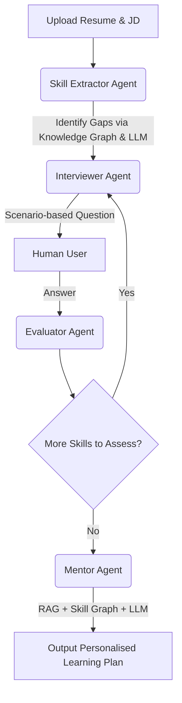

# Catalyst: AI-Powered Skill Assessment & Personalised Learning Plan Agent

A resume tells you what someone claims to know — not how well they actually know it. Catalyst is an AI-powered agent built with **LangGraph**, **LangChain**, and **Streamlit** that takes a Job Description (JD) and a candidate's resume, conversationally assesses real proficiency on each required skill, identifies gaps, and generates a personalised learning plan focused on adjacent skills the candidate can realistically acquire — with curated resources and time estimates.

---

## 🚀 Working Prototype & Setup

### Local Setup Instructions

1. Clone the repository:
   ```bash
   git clone <repository-url>
   cd catalyst-project-main
   ```

2. Create a virtual environment and install dependencies:
   ```bash
   python -m venv venv
   source venv/bin/activate  # On Windows use: .\venv\Scripts\activate
   pip install -r requirements.txt
   ```

3. Configure Environment Variables:
   Create a `.env` file in the root directory and add your Google Gemini API Key:
   ```
   GOOGLE_API_KEY=your_api_key_here
   ```

4. Run the Streamlit application:
   ```bash
   streamlit run app.py
   ```

Deployed URL: https://catalyst-project-sandeep-balabantaray.streamlit.app/

---

## 🎥 Demo Video

[Watch the 3-5 minute demo video walkthrough here](Insert YouTube/Loom Link Here)

---

## 🏗 Architecture Diagram

Catalyst leverages a multi-agent architecture orchestrated by LangGraph.



## 🧠 Scoring and Logic

Catalyst utilizes a sophisticated **Hybrid Scoring Engine** and **Skill Knowledge Graph** to ensure deterministic and objective assessments, preventing LLM hallucinations.

1. **Skill Extraction (`skill_extractor`):**
   - **Deterministic Graph Matching:** First queries a NetworkX Skill Knowledge Graph to extract skills required in the JD that are missing from the resume.
   - **LLM Fallback:** If the graph yields fewer than 3 gaps, it uses Gemini to intelligently extract remaining core technical skills.

2. **Assessment Loop (`interviewer` & `evaluator`):**
   - **Interviewer:** Generates open-ended, scenario-based interview questions to probe for *actual hands-on experience* rather than trivia definitions.
   - **Evaluator (Hybrid Scoring Engine):** Scores answers on a 0-5 scale and assigns proficiency levels (Novice to Expert) using a weighted 3-signal approach:
     - **LLM Score (50%):** Qualitative depth assessment by the LLM.
     - **Semantic Similarity (30%):** ChromaDB distance comparison against expected concepts.
     - **Keyword Coverage (20%):** Exact matching for expected technical terms.

3. **Personalised Learning Plan (`mentor`):**
   - **RAG Resource Curator:** Retrieves real, curated learning resources from a ChromaDB vector store. No hallucinated URLs.
   - **Graph-based Advice:** Suggests adjacent skills and prerequisites based on the Knowledge Graph.
   - Outputs a highly personalized 4-6 week markdown study plan with actionable weekly goals, curated resource links, and realistic time estimates.

---

## Sample Inputs and Outputs

**Sample Input (JD):**
"Looking for a Backend Python Developer experienced with Django, PostgreSQL, and REST APIs. Experience with Docker and CI/CD pipelines is a plus."

**Sample Input (Resume):**
"Software Engineer with 2 years of experience. Built applications using Python and Flask. Some experience with SQL databases like MySQL."

**Sample Output (Learning Plan Excerpt):**
- **Goal**: Master Django ORM and REST Framework.
- **Resource**: [Build a simple blog API using Django REST Framework (DRF)](https://example.com/drf-tutorial) · *Tutorial* · ~15h
- **Time Estimate**: 15 hours.
- **Goal**: Transition from MySQL to PostgreSQL and containerize the app.
- **Resource**: [Dockerize the Django blog API](https://example.com/docker-django) · *Documentation* · ~10h
- **Time Estimate**: 10 hours.
